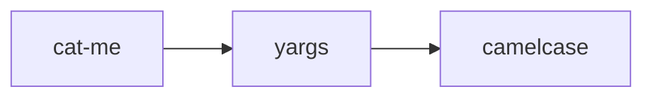

## What is a Package?


A package is a code that is written by an another developer and we can directly use it .
___
### Fromal def. 
A package is a bundled unit of code, resources, and metadata that makes software easy to distribute, install, update, and manage. It can contain executables, libraries, configuration files, documentation, and dependency information, and is delivered in formats like .deb, .rpm, .msi, .pkg, or language‑specific registries such as npm, PyPI, or Maven.


## How packages work 

for using a pakage like cat-me we simplely install the pakage by `npm install cat-me` and the code for catme pakage will get in the `node_moudles` folder which we can use .

the package are managed by the package.json 

``` 
{
  "dependencies": {
    "cat-me": "^1.0.3"
  }
}
```

as our may also be using some other package it also get insatlled in th `node_modules` and these are managed by package-lock.json which automaticaly manage them.

for example


